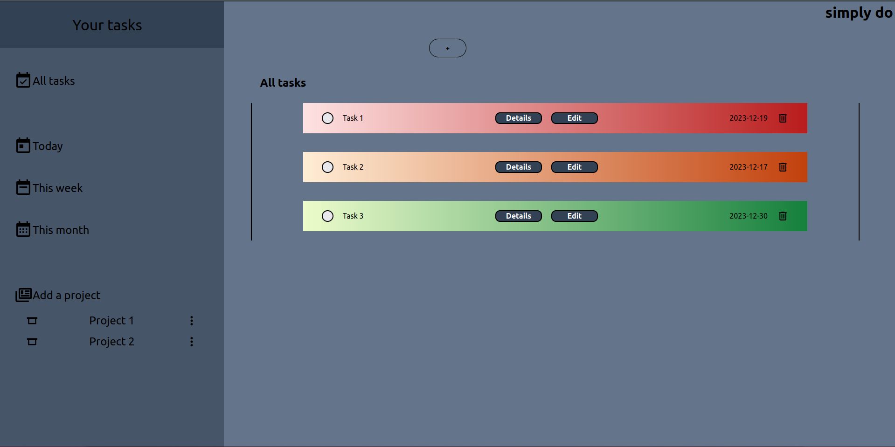
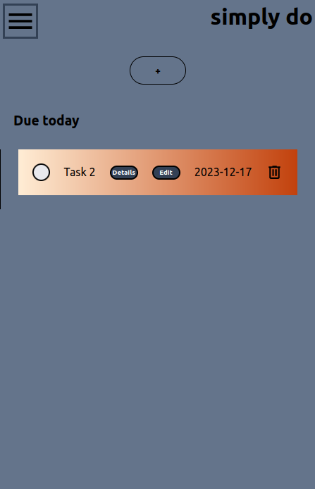

# todo-list
This project is suggested by The Odin Project curriculum.

It is made in html, vanilla css and vanilla javascript, localStorage for saving/loading tasks and projects and it is bundled together with webpack.

Made to work on all sizes, including mobile.

Live preview: [simply do](https://bqnic.github.io/todo-list/)

